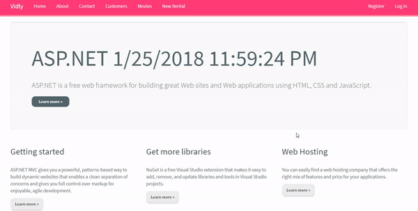

# Vidly

This is a demo app built along with [The Complete ASP.NET MVC 5 Course](https://www.udemy.com/the-complete-aspnet-mvc-5-course/)



To build this project you have to have a mdf file for database which in this example it is **aspnet-Vidly-20180110104707.mdf**

Another thing to mention is to include an **AppSettings.config** file.

For example,

```xml
<appSettings>
  <add key="MailServer" value="dev-smtp.vidly.com1"/>
  <add key="FacebookAppId" value="12345"/>
  <add key="FacebookAppSecret" value="12345"/>
  <add key="webpages:Version" value="3.0.0.0" />
  <add key="webpages:Enabled" value="false" />
  <add key="ClientValidationEnabled" value="true" />
  <add key="UnobtrusiveJavaScriptEnabled" value="true" />
</appSettings>

``` 